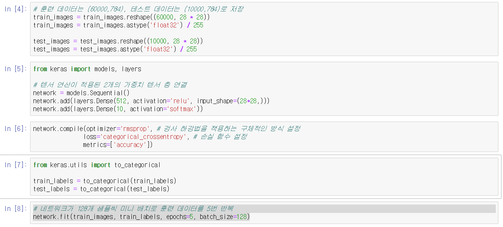

# 2. 시작하기 전에: 신경망의 수학적 구성 요소

## 2.1 신경망과의 첫 만남

* 클래스: 분류 문제의 범주(category)
* 샘플: 데이터 포인트
* 레이블: 특정 샘플의 클래스

* 케라스 파이썬 라이브러리를 사용하여 손글씨 숫자 분류를 학습하는 예제
	```
	from keras.datasets import mnist
	(train_images, train_labels), (test_images, test_labels) = mnist.load_data()
	```
	* 작업 순서
		* 먼저 훈련 데이터를 네트워크에 주입
		* 학습
		* 테스트에 대한 예측을 요청
		* 예측이 맞는지 확인
	```
	network = models.Sequential()
	network.add(layers.Dense(512, activation='relu', input_shape(28 * 28)))
	network.add(layers.Dense(10, activation='softmax'))
	```
	* 신경망의 핵심 구성요소는 **층**
	* 층은 주어진 문제에 더 의미 있는 표현을 입력된 데이터로부터 추출
	* 이 예에서는 신경망 층인 Dense 층 2개가 연속되어 있다.
	* 두 번째 층은 10개의 확률 점수가 들어 있는 배열을 반환하는 소프트맥스(softmax) 층
	* **손실 함수(loss function)**: 훈련 데이터에서 신경망의 성능을 측정하는 방법으로 네트워크가 옳은 방향으로 학습될 수 있도록 도와줌
	* **옵티마이저(optimizer)**: 입력된 데이터와 손실 함수를 기반으로 네트워크를 업데이트하는 메커니즘
	* **훈련과 테스트 과정을 모니터링할 지표**: 여기에서는 정확히 분류된 이미지의 비율만 고려한다.
	```
	network.compile(optimizer='rmsprop',
					loss='categorical_crossentropy',
					metrics=['accuracy'])
	```
	* 훈련을 시작하기 전에 데이터를 네트워크에 맞는 크기로 바꾸고 모든 값을 0과 1사이로 스케일을 조정
	* 레이블을 범주형으로 인코딩
	```
	network.fit(train_images, train_labels, epochs=5, batch_size=128)
	```
	* **과대적합(overfitting)**: 머신 러닝 모델에 훈련 데이터보다 새로운 데이터에서 성능이 낮아지는 경향

## 2.2 신경망을 위한 데이터 표현

* **텐서(tensor)**: 데이터를 위한 컨테이너, 임의의 차원(축) 개수를 가지는 행렬의 일반화된 모습
* 2.2.1 스칼라(0D 텐서)
	* 스칼라(scalar): 하나의 숫자만 담고 있는 텐서
	* 넘파이에서는 float32, float64
	* 랭크(rank): 스칼라 텐서의 축 개수
	* ndim을 이용하여 축 개수 확인 가능
* 2.2.2 벡터(1D 텐서)
	* **벡터(vector)**: 숫자의 배열
	* 차원수(dimensionallity): 특정 축을 따라 놓인 원소의 개수이거나 텐서의 축 개수를 의미하여 혼동하기 쉬움
* 2.2.3 행렬(2D 텐서)
	* **행렬(matrix)**: 벡터의 배열
* 2.2.4 3D 텐서와 고차원 텐서
* 2.2.5 핵심 속성
	* **축의 개수(랭크)**
	* **크기(shape)**: 텐서가 각 축을 따라 얼마나 많은 차원이 있는지를 나타낸 파이썬의 튜플(tuple)
	* **데이터 타입(넘파이에서는 dtype)**: 텐서에 포함된 데이터의 타입(ex. float32, float64, unit8), 가변 길이는 지원 X
* 2.2.6 넘파이로 텐서 조작하기
	* 슬라이싱(slicing): 배열에 있는 특정 원소를 선택하는 것
	```
	my_slice = train_images[10:100]
	my_slice = train_images[10:100, :, :]
	my_slice = train_images[10:100, 0:28, 0:28]
	my_slice = train_images[:, 14:, 14:] # 14픽셀 이후?
	my_slice = train_images[:, 7:-7, 7:-7] # 정중앙에 위치한 14 X 14 를 잘라냄
	```
* 2.2.7 배치 데이터
	* 샘플 축(sample axis): 일반적으로 딥러닝에서 사용하는 모든 데이터 텐서의 첫 번째 축(0번째 축)
	* 배치축(배치 차원): 배치 데이터에서 첫 번째 축
* 2.2.8 텐서의 실제 사례
	* 벡터 데이터: (samples, features) 크기의 2D 텐서
	* 시계열 데이터 또는 시퀀스 데이터: (samples, timestamps, features) 크기의 3D 텐서
	* 이미지: (samples, height, width, channels) 또는 (samples, channels, height, width) 크기의 4D 텐서
	* 동영상: (samples, frames, height, width, channels) 또는 (samples, frames, channels, height, width) 크기의 5D 텐서
* 2.2.9 벡터 데이터
	* ex. 사람의 나이, 우편번호, 소득/ 10만명 => (100000, 3)
* 2.2.10 시계열 데이터 또는 시퀀스 데이터
	* ex. 주식 가격 데이터셋(1분마다 현재 주식 가격, 지난 1분동안에 최고 가격, 최소 가격)/하루의 거래 시간은 390분/250일 => (250, 390, 3)
* 2.2.11 이미지 데이터
	* 높이, 너비, 컬러 채녈의 3차원
	* ex. 256X256 크기의 RGB/128 개의 배치 => 채녈 마지막(128, 256, 256, 3)/ 채널 우선(128, 3, 256, 256)
* 2.2.12 비디오 데이터
	* ex. 60초/144X256/4프레임으로 샘플링하면 240프레임 => (4, 240, 144, 256, 3)

## 2.3 신경망의 톱니바퀴: 텐서 연산

* 텐서 연산 예시
	```
	keras.layers.Dense(512, activation='relu')
	output=relu(dot(W, input) + b)
	```
* 2.3.1 원소별 연산(element-wise operation)
	* relu 함수와 덧셈은 원소별 연산(텐서에 있는 각 원소에 독립적으로 적용)
	* 고도의 병력 구현이 가능한 연산
	* 넘파이는 BLAS(Basic Linear Algebra Subprogram) 구현에 복잡한 일들을 위임
* 2.3.2 브로드캐스팅
	* 브로드캐스팅 단계
		1. 큰 텐서의 ndim에 맞도록 작은 텐서에 브로드캐스팅 축 추가
		2. 작은 텐서가 새 축을 따라서 큰 텐서의 크기에 맞도록 반복
* 2.3.3 텐서 점곱
	* **텐서 곱셈(tensor product)**: 원소별 연산과 반대로 입력 텐서의 원소들을 결합
	* keras에서는 dot
	* 두 텐서 중 하나라도 ndim이 1보다 크면 교환 법칙 성립X
	* ex. (a,b,c,d) 점곱 (d, ) -> (a,b,c) / (a,b,c,d) 점곱 (d,e) -> (a,b,c,e)
* 2.3.4 텐서 크기 변환
	* 특정 크기에 맞게 열과 행을 재배열
	* 자주 사용하는 특별한 크기 변환은 전치(transposition): 행과 열 바꾸기
* 2.3.5 텐서 연산의 기하학적 해석
	* 텐서 연산이 조작하는 텐서의 내용은 어떤 기하학적 공간에 있는 좌표 포인트로 해셕될 수 있기 때문에 모든 텐서 연산은 기하학적 해석이 가능
	* 아핀 변환, 회전, 스케일링 가능
* 2.3.6 딥러닝의 기하학적 해석
	* ex. 종이공 펼치기
	* 심하게 꼬여 있는 데이터의 매니폴드에 대한 깔끔한 표현을 찾는 일

## 2.4 신경망의 엔진: 그래디언트 기반 최적화
* output = relu(dot(W, input) * b)
* W와 b는 **가중치** 또는 훈련되는 파라미터(커널과 편향(bias))
* 처음에는 작은 난수로 채워져 있다.(**무작위 초기화**)
* 훈련 반복 루프
	1. 훈련 샘플 x와 이에 상응하는 타깃 y의 배치를 추출
	2. x를 사용하여 네트워크를 실행하고(정방향 패스(forward pass)), 에측 y_pred를 구한다.
	3. y_pred와 y의 차이를 측정하여 이 배치에 대한 네트워크의 손실을 계산
	4. 배치에 대한 손실이 조금 감소되도록 네트워크의 모든 가중치를 업데이트
* 가중치를 업데이트할 때 신경망에 사용된 모든 연산이 미분 가능하다는 장점을 사용하여 네트워크 가중치에 대한 손실의 **그래디언트(gradient)** 계산
* 2.4.1 변화율이란?
	* f(x + epsilon_x) = y + epsilon_y
	* 여기서 epsilon_x가  충분히 작다면 어떤 포인트 p에서 기울기 a의 선형 함수로 f를 근사 가능
	* f(x + epsilon_x) = y + a * epsilon_x
	* 이 기울기를 p에서 f의 뱐화율(derivate)이라고 함
* 2.4.2 텐서 연산의 변화율: 그래디언트
	* 입력 벡터 x, 행렬 W, 타깃 y, 손실 함수 loss가 있다고 가정
	* y_pred = dot(W, x)
	* loss_value = loss(y_pred, y)
	* x와 y가 고정되어 있다면 loss_value = f(W)
	* W의 현재값을 W0로 가정
	* W0에서 f의 변화율은 W와 같은 크기의 텐서인 gradient(f)(W0) = f(W)의 기울기
	* 그래디언트의 반대 방향으로 움직이면 f(W)의 값을 줄일 수 있음
* 2.4.3 확률적 경사 하강법
	* 미분 가능한 함수면 이론적으로 최솟값을 해석적으로 구할 수 있다.(변화율이 0인 지점 중 하나)
	* N(네트워크긔 가중치 개수)개의 변수로 이루어진 다항식
	* N이 수천만 개가 되기 때문에 해석적으로 푸는 것은 어려움
	* 그래서 그래디언트의 반대 방향으로 가중치를 업데이트하여 손실을 감소 시킴(**미니 배치 확률적 경사 하강법(mini-batch stochastic gradient descent)**)
		1. 훈련 샘플 x와 이에 상응하는 타깃 y의 배치를 추출
		2. x를 사용하여 네트워크를 실행하고(정방향 패스(forward pass)), 에측 y_pred를 구한다.
		3. y_pred와 y의 차이를 측정하여 이 배치에 대한 네트워크의 손실을 계산
		4. 네트워크의 파라미터에 대한 손실 함수의 그래디언트를 계산(**역방향 패스(backward pass)**)
		5. 그래디언트의 반대 방향으로 파라미터를 조금 이동시킴(W -= step * gradient)
	* 가중치를 업데이트할 때 신경망에 사용된 모든 연산이 미분 가능하다는 장점을 사용하여 네트워크 가중치에 대한 손실의 그래디언트(gradient) 계산
	* 확률적(stochastic)은 무작위적인 것의 과학적 표현
	* 이동 스케일인 step 값을 적절히 고르는 것이 중요
	* **옵티마이저(최적화 방법)**: 업데이트할 다음 가중치를 계산할 때 현재 그래디언트 값만 보지 않고 이전에 업데이트된 가중치를 여러 가지 다른 방식으로 고려하는 SGD 변종
	* 모멘텀(momentum)을 이용하여 SGD에 있는 2개의 문제점인 수렴 속도와 지역 최솟값을 해결
	* **모멘텀**: 현재 기울기 값(현재 가속도)뿐만 아니라 (과거의 가속도로 인한) 현재 속도를 함께 고려하여 각 단계에서 공을 움직임(지역 최솟값에 빠지지 않음)
* 2.4.4 변화율 연결: 역전파 알고리즘
	* 연쇄 법칙을 신경망의 그래디언트 계산에 적용하여 **역전파(backpropagation) 알고리즘** 탄생

## 2.5 첫 번째 예제 다시 살펴보기
	
